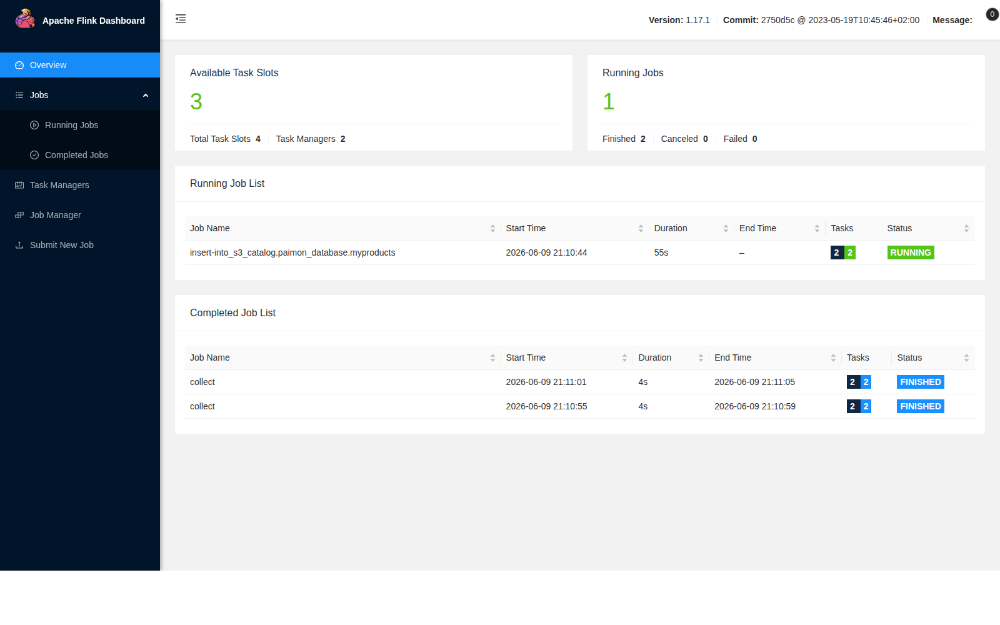
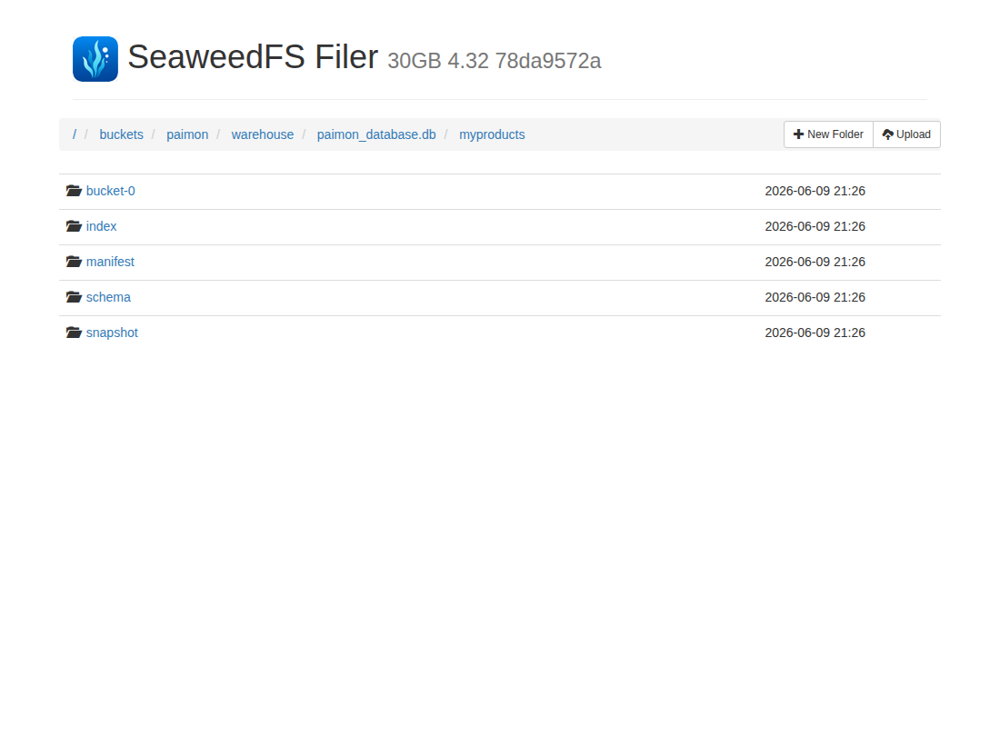
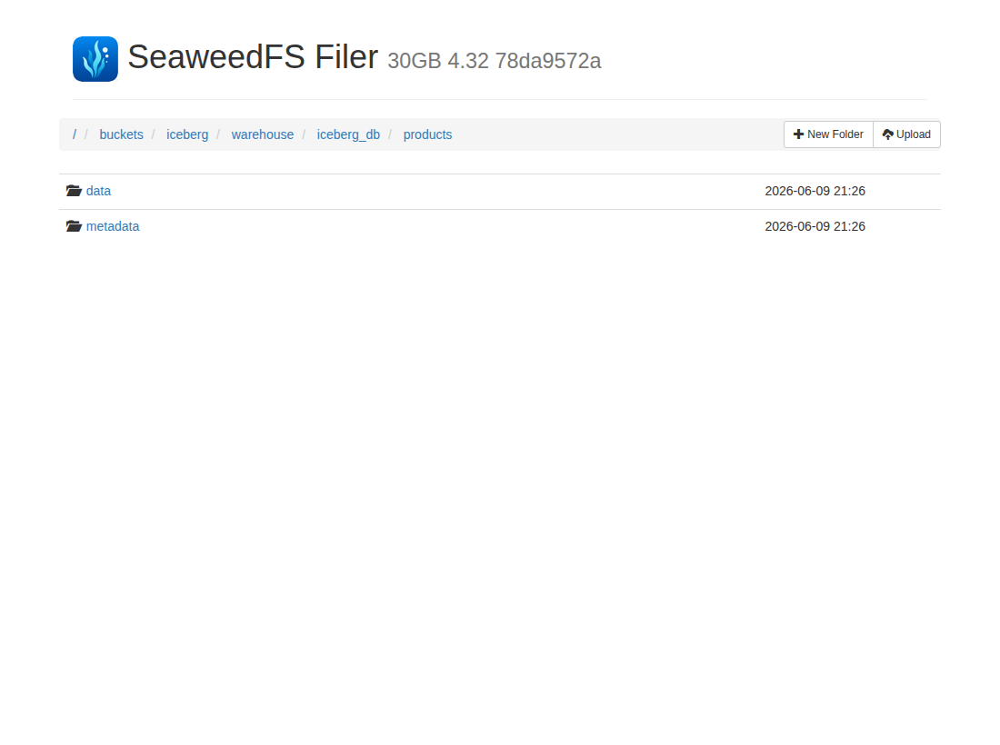
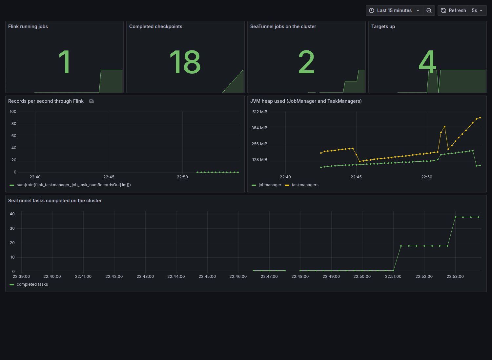
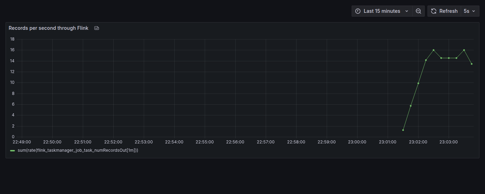

# Apache Flink, Paimon, SeaTunnel and Iceberg on SeaweedFS

A working example of a streaming lakehouse you can run end to end on your own machine: change data capture from MariaDB into Paimon with Flink, then SeaTunnel reading Paimon and writing Iceberg, all on SeaweedFS, with Prometheus and Grafana over the top.

The whole stack runs on Docker Compose against SeaweedFS, so there is no AWS account, no real bucket, and no manual credential setup.

## What it does

The full path runs end to end:

```
MariaDB products -> Flink CDC -> Paimon on SeaweedFS -> SeaTunnel (transform) -> Iceberg on SeaweedFS
```

1. Flink reads the MariaDB `products` table with the MySQL CDC connector and streams it into a Paimon table on SeaweedFS.
2. SeaTunnel reads that Paimon table straight from SeaweedFS.
3. SeaTunnel adds a `price_band` column and writes the result into an Iceberg table on SeaweedFS.

Each step has a command that prints what it produced, so you can confirm the data is real at every stage.

## Stack versions

The stack targets the **Flink 1.20 LTS** line. The Flink, Paimon and CDC components are chosen to be mutually compatible against it; SeaTunnel runs its own Zeta engine, so its version is independent of Flink.

| Component | Version | Notes |
| --- | --- | --- |
| Flink | 1.20.4 (Java 11 image) | LTS line |
| Flink MySQL CDC connector | 3.6.0-1.20 | `org.apache.flink`, built for Flink 1.20 |
| MySQL JDBC driver | mysql-connector-j 8.4.0 | needed by the CDC connector's snapshot phase |
| Paimon (Flink connector) | 1.2.0 | `paimon-flink-1.20` and `paimon-s3` |
| Flink S3 filesystem | flink-s3-fs-hadoop 1.20.4 | matches Flink |
| MariaDB | 10.6.14 | CDC source |
| SeaweedFS | 4.32 | Apache-2.0 S3-compatible storage and bucket init |
| SeaTunnel | 2.3.13 | runs as a Zeta cluster; reads Paimon, writes Iceberg |
| Iceberg | 1.6.1 (bundled in the SeaTunnel Iceberg connector) | written via a Hadoop catalog |
| Prometheus | v3.5.0 | scrapes Flink and SeaTunnel metrics |
| Grafana | 11.5.0 | dashboard over the metrics |

The Flink and SeaTunnel versions live in `.env` (`FLINK_VERSION`, `SEATUNNEL_VERSION`) and feed both Compose and the SeaTunnel image build. The jar versions and their SHA512 checksums are pinned in `scripts/download_jars.sh`.

## Prerequisites

- Docker Engine with the Compose V2 plugin (the `docker compose` subcommand, not the old `docker-compose` binary). Tested with Docker 29.5 and Compose v5.1.
- `make` and `curl` on the host.
- Internet access on the first run to download the connector jars (about 200 MB) from Maven Central.
- Around 4 GB of free disk for the images and the downloaded connector jars, and roughly 6 GB of memory free for the full stack (Flink, SeaTunnel cluster, SeaweedFS, Prometheus and Grafana).

## Quick start

```
make jars                        # download the Flink and Paimon connector jars
docker compose build seatunnel   # build the local SeaTunnel image
make up                          # start MariaDB, SeaweedFS and the Flink cluster
make submit                      # submit the Flink CDC job
make verify                      # read the Paimon table back
make seatunnel-read              # SeaTunnel reads Paimon and prints the rows
make seatunnel-iceberg           # SeaTunnel transforms Paimon into Iceberg
make verify-iceberg              # read the Iceberg table back
make down                        # stop everything and remove volumes
```

The rest of this README explains each step and the output to expect.

## Step by step

### 1. Download the connector jars

The Flink, Paimon and CDC connector jars are not committed to the repository. Fetch them with:

```
make jars
```

This runs `scripts/download_jars.sh`, which downloads each jar from a pinned Maven Central URL and checks it against a known SHA512 before saving it under `jars/`. Re-running is cheap because it skips jars that are already present and valid. `make up` runs this step for you, so it is optional to run on its own.

### 2. Build the SeaTunnel image

There is no fully up to date SeaTunnel image on Docker Hub for this setup, so the stack builds one locally from `seatunnel/Dockerfile`. It installs SeaTunnel 2.3.13 and only the connectors this example needs (fake, console, paimon and iceberg).

```
docker compose build seatunnel
```

You can also build it directly with `docker build -t seatunnel:2.3.13 -f seatunnel/Dockerfile seatunnel`.

### 3. Start the stack

```
make up
```

This starts MariaDB (seeded with 30 products), SeaweedFS, a one-off step that creates the `paimon` and `iceberg` buckets, the Flink cluster (one JobManager and two TaskManagers), a long-lived SeaTunnel Zeta cluster, and Prometheus and Grafana. The one-off SeaTunnel job client is held back behind a Compose profile because it runs per job rather than as a service.

- Flink UI: http://localhost:8081
- SeaweedFS S3 endpoint: http://localhost:9000 (access key `admin`, secret key `adminsecret`)
- SeaweedFS Filer UI: http://localhost:8888 (browse the buckets under `/buckets`)
- Prometheus: http://localhost:9090
- Grafana: http://localhost:3000 (anonymous access; see the monitoring section below)

### 4. Submit the Flink CDC job

`make up` does not submit any work on its own. Submit the CDC pipeline in `jobs/job.sql` with:

```
make submit
```

This waits for Flink, SeaweedFS and MariaDB to be ready, then runs the Flink SQL client against `jobs/job.sql`. The job enables checkpointing (Paimon commits on checkpoint) and streams the MariaDB `products` table into the Paimon `myproducts` table on SeaweedFS.

Open the Flink UI and look under **Running Jobs**; you should see `insert-into_s3_catalog.paimon_database.myproducts` in the `RUNNING` state.



### 5. Verify the data landed in Paimon

Give the job a few seconds to take its first checkpoint, then read the table back:

```
make verify
```

This runs a one-off batch query against the Paimon table and prints a row count and a sample with ids, names and prices:

```
+-----------+
| row_count |
+-----------+
|        30 |
+-----------+

+----+------------------------+--------+
| id |                   name |  price |
+----+------------------------+--------+
|  1 |  Organic Almond Butter |  10.99 |
|  2 |      Whole Grain Bread |   3.49 |
|  3 | Cold Pressed Olive Oil |  15.99 |
+----+------------------------+--------+
```

In the SeaweedFS Filer UI you can see the Paimon table laid out under the `paimon` bucket, with its data, manifest, schema and snapshot files:



### 6. Watch change data capture (optional)

The job keeps running, so changes made in MariaDB after the initial snapshot flow through to Paimon too. Apply a sample change with:

```
make cdc-change
```

This updates one product's price and deletes another in MariaDB. Wait about ten seconds for the next checkpoint, then run `make verify` again: the row count drops to 29 and `Organic Almond Butter` shows a price of `12.49`.

### 7. Read the Paimon table with SeaTunnel

```
make seatunnel-read
```

SeaTunnel reads `paimon_database.myproducts` straight from SeaweedFS using `seatunnel/paimon-to-console.conf`. The job is submitted to the SeaTunnel Zeta cluster (`-m cluster`), so the client prints the job summary:

```
Job (...) end with state FINISHED
Total Read Count : 30
Total Write Count : 30
Total Failed Count : 0
```

Because the job runs on the cluster, the console sink rows themselves are written to the cluster's log:

```
docker compose logs seatunnel-cluster | grep ConsoleSinkWriter
...
SeaTunnelRow#kind=INSERT : 1, Organic Almond Butter, 10.99
SeaTunnelRow#kind=INSERT : 2, Whole Grain Bread, 3.49
```

These are the real products written by Flink, not generated rows.

### 8. Transform Paimon into Iceberg with SeaTunnel

```
make seatunnel-iceberg
```

This runs `seatunnel/paimon-to-iceberg.conf`, which reads `paimon_database.myproducts`, adds a `price_band` column (`budget`, `mid` or `premium` based on price) with a SQL transform, and writes the result into the `iceberg_db.products` Iceberg table in the `iceberg` bucket using a Hadoop catalog. The write uses `DROP_DATA`, so re-running keeps the table at the same row count rather than appending.

### 9. Verify the Iceberg table

```
make verify-iceberg
```

This runs `seatunnel/iceberg-to-console.conf` on the cluster. The client reports `Total Read Count : 30`, and the rows with the new `price_band` column are in the cluster log:

```
docker compose logs seatunnel-cluster | grep ConsoleSinkWriter
...
SeaTunnelRow#kind=INSERT : 1, Organic Almond Butter, 10.99, premium
SeaTunnelRow#kind=INSERT : 2, Whole Grain Bread, 3.49, budget
SeaTunnelRow#kind=INSERT : 3, Cold Pressed Olive Oil, 15.99, premium
```

The Iceberg table lands in the `iceberg` bucket on SeaweedFS, with the usual `data` and `metadata` directories:



### 10. Tear down

```
make down
```

This stops the stack and removes its volumes, so the next run starts clean.

## Monitoring with Prometheus and Grafana

The stack ships with Prometheus and Grafana so you can watch the pipeline rather than only reading container logs.

- **Flink** exposes Prometheus metrics from the JobManager and TaskManagers on port `9249` (enabled through `metrics.reporter.prom` in the Compose `FLINK_PROPERTIES`).
- **SeaTunnel** runs as a long-lived Zeta cluster with telemetry enabled, exposing metrics at `:5801/hazelcast/rest/instance/metrics`. The SeaTunnel jobs (`make seatunnel-read`, `make seatunnel-iceberg`) are submitted to this cluster, so their activity shows up in the metrics.

Prometheus (http://localhost:9090) scrapes both. Open Grafana at http://localhost:3000 (anonymous access is enabled) and the **Flink + SeaTunnel pipeline** dashboard is provisioned automatically. It shows Flink running jobs and checkpoints, records per second, JVM heap, the number of SeaTunnel jobs on the cluster, and SeaTunnel tasks completed:



The charts react to real activity. Submit the CDC job, push some changes through MariaDB and run a few SeaTunnel jobs, and the Flink throughput, checkpoints and SeaTunnel completed-task counts all climb:



## SeaTunnel image smoke test

To confirm the SeaTunnel image builds and starts on its own, without the rest of the stack, run the bundled sample job. It generates a few fake rows and prints them to the console:

```
docker compose run --rm seatunnel
```

You should see rows logged through the console sink and the job finish without errors.

## Make targets

| Target | What it does |
| --- | --- |
| `make up` | Start MariaDB, SeaweedFS, the Flink cluster, the SeaTunnel cluster, Prometheus and Grafana |
| `make submit` | Submit the Flink CDC job in `jobs/job.sql` |
| `make verify` | Read the Paimon table back and print a count and sample |
| `make cdc-change` | Change a row in MariaDB to watch CDC flow through |
| `make seatunnel-read` | SeaTunnel reads the Paimon table and prints the rows |
| `make seatunnel-iceberg` | SeaTunnel transforms Paimon and writes the Iceberg table |
| `make verify-iceberg` | Read the Iceberg table back |
| `make logs` | Follow the Flink JobManager logs |
| `make down` | Stop the stack and remove volumes |

## Good to know

- The stack runs locally and uses throwaway SeaweedFS credentials defined in `.env` and `seaweedfs/s3.json`. Swap in your own object store and credentials to point it at real infrastructure.
- The connector jars are pinned to specific versions and downloaded on demand rather than committed. See the stack versions table for the exact, mutually compatible set.
- SeaTunnel runs on its own single-node Zeta cluster (not on the Flink cluster). Because jobs run on the cluster, their console output appears in the SeaTunnel cluster log rather than the terminal.
- The Flink CDC job runs continuously until you run `make down`.
